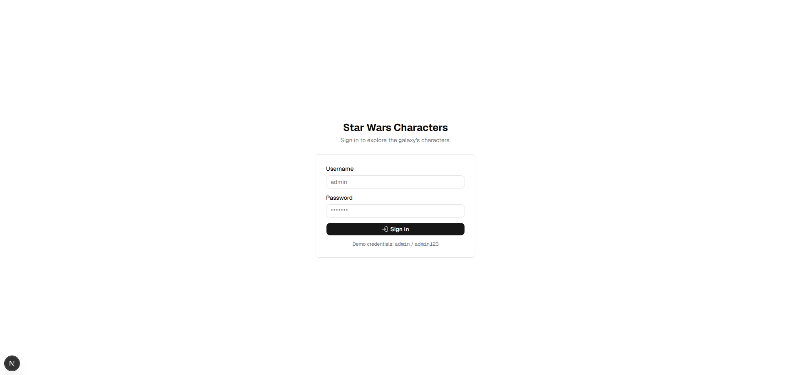
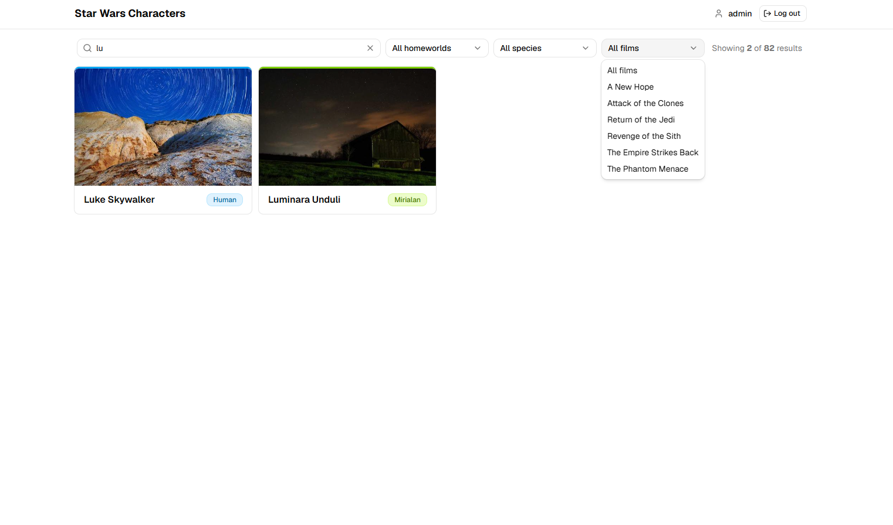

# MERN + TypeScript: Star Wars Character App

A responsive Star Wars character explorer built with **Next.js (App Router) + React 19 + TypeScript + Tailwind CSS v4**, powered by the public [SWAPI](https://swapi.info) REST API. It fetches the entire dataset once and caches it with **TanStack Query**, then delivers a fast client-side experience for **searching, filtering, and pagination** over that cached array.

Optional brownie-point features are included: **search + combined filters**, **mock JWT authentication with silent refresh** (http-only cookies, no localStorage), and an **integration test** for the character details modal.

---

## Live demo & submission

> Update these once deployed / recorded:

- **Hosted app (Vercel / Netlify / Cloudflare Pages):** `https://<your-app>.vercel.app`
- **Repo:** `tsx-mern-05Aug2026`
- **Demo video (YouTube / GDrive):** `https://...`

**Demo login:** username `admin` / password `admin123`.

---

## Features

### Core requirements
- **API integration** — fetches all characters from `https://swapi.info/api/people` (83 characters) plus planets, species, and films for lookups.
- **Loading state** — spinner + skeleton cards while data is fetched/refetched.
- **Error state** — friendly error card with a **Retry** button when the API is unreachable.
- **Pagination** — client-side pagination (12/page) over the cached, filtered result set, with prev/next and numbered pages.
- **Character cards** — name + a random Picsum photo per character (`picsum.photos/seed/…`); refresh or click "Shuffle images" for new pictures.
- **Species-based coloring** — each card is tinted by the character's species; **hover animation** (lift + colored glow + image zoom).
- **Details modal** — click a card to open it:
  - Header: character name
  - Height in **meters**, mass in **kg**
  - Date added to the API in **dd-MM-yyyy**
  - Number of films, birth year
  - **Homeworld** block: name, terrain, climate, and number of residents

### Brownie points (included)
- **Search** — partial/complete name search (case-insensitive, debounced).
- **Filters** — homeworld, species, or film dropdowns; all search + filters combine (AND).
- **JWT authentication** — mocked login/logout with http-only cookies and **silent refresh** when the access token expires.
- **Integration test** — verifies clicking a card opens the modal with the correct person's information (Vitest + Testing Library + MSW).

---

## Tech stack

| Layer      | Choice |
|------------|--------|
| Framework  | Next.js 16 (App Router) |
| UI         | React 19 + TypeScript |
| Styling    | Tailwind CSS v4 + shadcn/ui |
| Data       | TanStack Query v5 |
| Animation  | `motion`, Tailwind transitions |
| Testing    | Vitest + React Testing Library + MSW |
| Auth (mock)| Next.js route handlers + http-only JWT cookies |

---

## Getting started

```bash
# 1. install dependencies (pnpm is the package manager)
pnpm install

# 2. (optional) configure JWT settings
cp .env.example .env.local

# 3. run the dev server
pnpm dev
# open http://localhost:3000

# 4. run tests / lint / build
pnpm test
pnpm lint
pnpm build
```

### Environment variables

| Variable                  | Default                          | Description |
|---------------------------|----------------------------------|-------------|
| `JWT_SECRET`              | dev-only fallback                | Secret used to sign mock JWTs |
| `JWT_ACCESS_EXPIRES`      | `120` (seconds)                  | Access token lifetime — kept short so silent refresh is visible |
| `JWT_REFRESH_EXPIRES`     | `3600` (seconds)                 | Refresh token lifetime |

---

## How it works

### Data flow
1. On first visit (after login) the app fetches `/people`, `/planets`, `/species`, and `/films` once via `useQuery` (`src/hooks/useSwapi.ts`).
2. `useCharacters` (`src/hooks/useCharacters.ts`) holds the search/filter state and derives the filtered + paginated slice with `useMemo` + `useDeferredValue`.
3. Cards, modal, and filters are pure presentational components in `src/components/`.

### Mock authentication (http-only cookies)
- `app/api/auth/login` validates the fake credentials and sets two **http-only** cookies: `sw_access` (short-lived JWT) and `sw_refresh`.
- `app/api/auth/refresh` exchanges the refresh cookie for a new access cookie.
- `app/api/auth/me` verifies the access cookie and returns the session (used at boot).
- `app/api/auth/logout` clears both cookies.
- The client never reads tokens from JavaScript — only cookie-backed requests via `src/lib/http.ts`. `AuthProvider` (`src/providers/AuthProvider.tsx`) schedules a **silent refresh** ~30s before expiry, so the session is renewed in the background.

---

## Screenshots

> Add 3–4 screenshots to `public/screenshots/` and reference them here (drop the `.png` files in that folder).

| Login | Character grid |
|-------|----------------|
|  |  |

| Details modal | Search & filters |
|---------------|------------------|
|  |  |

---

## Project structure

```
app/
  page.tsx                      # auth-gated shell (login vs explorer)
  api/auth/{login,refresh,me,logout}/route.ts   # mocked JWT endpoints
src/
  components/
    auth/LoginForm.tsx          # login UI
    auth/UserMenu.tsx           # user + logout
    character/
      CharacterExplorer.tsx     # page composition + hooks wiring
      CharacterCard.tsx         # species-tinted card with random image
      CharacterDetailsModal.tsx # details + homeworld
      CharacterPagination.tsx   # pager
      SearchAndFilterBar.tsx    # search + 3 filters
      speciesStyles.ts          # species -> tailwind color classes
    ui/                         # shadcn/ui primitives
  hooks/
    useSwapi.ts                 # people/planets/species/films queries + lookups
    useCharacters.ts            # search/filter/pagination controller
  lib/
    constants.ts, swapi.ts, format.ts, speciesColor.ts, http.ts, authServer.ts
  providers/
    QueryProvider.tsx, AuthProvider.tsx
  test/
    __tests__/modal.test.tsx    # integration test
    handlers.ts, server.ts, setup.ts, fixtures.ts
```

---

## Testing

```bash
pnpm test
```

The integration test (`src/test/__tests__/modal.test.tsx`):
1. Boots the app (auth mocked via MSW).
2. Waits for the character grid to load.
3. Clicks Luke Skywalker's card.
4. Asserts the modal opens with his **name**, **height in meters**, **mass in kg**, **date added**, **film count**, **birth year**, and **homeworld** details.

---

## Deployment (Vercel)

1. Push the repo (`tsx-mern-05Aug2026`) to GitHub.
2. Import into Vercel (framework preset: Next.js). No build config needed.
3. Add the `JWT_SECRET` env var in Vercel → Settings → Environment Variables.
4. Deploy. The UI and `/api/auth/*` route handlers are served from the same app.
